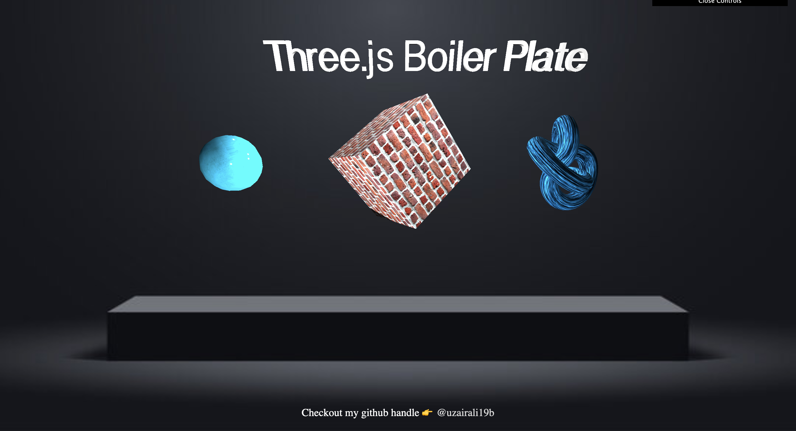

# Three.js Boiler Template

> This is a basic boilerplate for anyone who starts to work with three.js. The boilerplate contains all the necessary three.js components to help you get started. The repo includes already setup linters for anyone to get started. Big shoutout to [Microverse](https://www.microverse.org/) for providing the linters configurations. In order to see the results that your repo is marked check, push your code for github actions to run your checks.



The boiler plate includes:

- Camera
- Geometry
- Materials
- Textures
- Mesh
- Lights
- Renderer
- Debugging with dat.gui

## Built With

- Threejs
- Vite
- Node Package Manager

## Live Demo

[Live Demo Link](https://three-js-boilerplate.vercel.app/)

## Getting Started

To get a local copy up and running follow these simple example steps:

### Setup

Download [Node.js](https://nodejs.org/en/download/).

##### Run the following commands:

For dependencies

```bash
# Install dependencies (only the first time)
npm install

# Run the local server at localhost:3000
npm run dev

# Build for production in the dist/ directory
npm run build
```

To test your code before pushing it to your repo:

```bash
# To check for any HTML errors
npx hint .

# To check for CSS errors
npx stylelint "**/*.{css,scss}"

# To check for Javascript errors
npx eslint .
```

## Authors

👤 **Author**

- GitHub: [@uzairali19](https://github.com/uzairali19)
- Twitter: [@uzairali751](https://twitter.com/Uzairali751)
- LinkedIn: [LinkedIn](https://www.linkedin.com/in/uzairali19/)

## 🤝 Contributing

Contributions, issues, and feature requests are welcome!

Feel free to check the [issues page](https://github.com/uzairali19/three-js-boilerplate/issues/).

## Show your support

Please give a ⭐️ if you like this project!

## Acknowledgments

- Shout out to Bruno Simon who has inspired me to follow this path. If you want to learn his extensive course check out. [Threejs Journey](https://threejs-journey.xyz/)

## 📝 License

This project is [MIT](./MIT.md) licensed.
